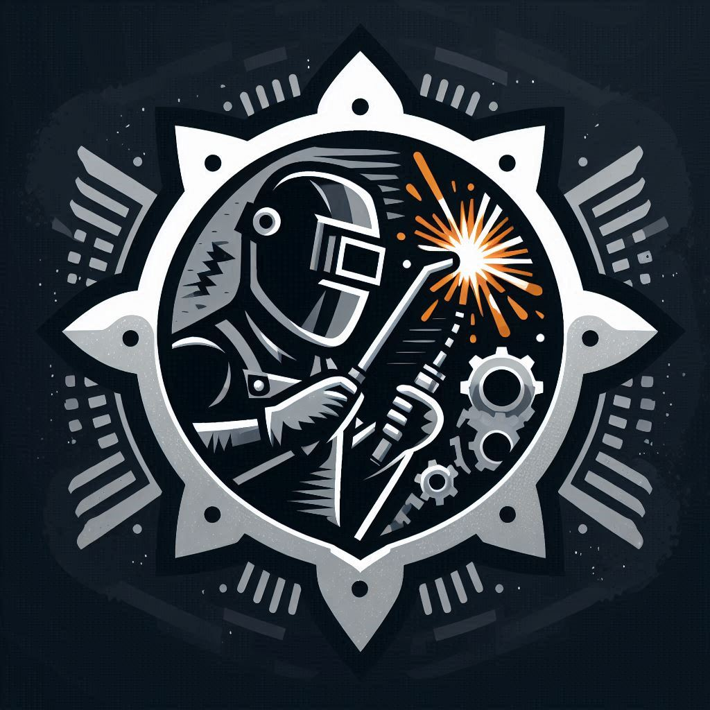

# Engineer Owino Ngode - Professional Welding & Fabrication

<div align="center">
  
  <p align="center">
    <strong>Precision Welding | Custom Fabrication | Industrial Maintenance</strong>
  </p>
  <p align="center">
    
    
    
  </p>
</div>

---

## 🚀 Overview

This is the official web application for **Engineer Owino Ngode**, a highly skilled welder with over **10 years of experience**. The platform showcases a comprehensive portfolio of welding projects, industrial services, and metal fabrication expertise.

Built with a focus on speed, responsiveness, and premium aesthetics, this site provides a seamless experience for clients looking for certified welding solutions.

## ✨ Key Features

- **Dynamic Portfolio**: A curated gallery of professional welding projects including structural steel, stainless steel, and aluminum works.
- **Service Showcase**: Detailed breakdown of specializations (TIG, MIG, Stick welding) and service sectors (Industrial, Residential, Mobile).
- **Interactive UX**: Smooth animations powered by **AOS (Animate On Scroll)** and **Framer Motion**.
- **Responsive Design**: Mobile-first architecture ensuring accessibility across all devices.
- **AI-Powered Assistance**: Integrated chatbot for client inquiries and service guidance.

## 🛠️ Tech Stack

- **Framework**: [React 19](https://reactjs.org/)
- **Build Tool**: [Vite](https://vitejs.dev/)
- **Styling**: [Tailwind CSS](https://tailwindcss.com/)
- **Animations**: [AOS](https://michalsnik.github.io/aos/) & [Framer Motion](https://www.framer.com/motion/)
- **Icons**: [Lucide React](https://lucide.dev/)
- **Routing**: [React Router Dom](https://reactrouter.com/)

## 📂 Project Structure

```bash
├── public/
│   ├── images/          # Project and brand assets
│   └── videos/          # Operational demonstrations
├── src/
│   ├── components/      # Reusable UI components
│   ├── context/         # Theme and State management
│   ├── data/            # Static content (services, portfolio)
│   ├── pages/           # High-level route components
│   └── hooks/           # Custom React hooks
└── tailwind.config.js   # Custom design tokens
```

## ⚙️ Development Setup

To run this project locally, follow these steps:

1. **Clone the repository**:
   ```bash
   git clone git@github.com:mastermind-creat/welding-app.git
   cd welding-app
   ```

2. **Install dependencies**:
   ```bash
   npm install
   ```

3. **Start the development server**:
   ```bash
   npm run dev
   ```

4. **Build for production**:
   ```bash
   npm run build
   ```

## 👨‍🏭 Expertise Highlights

- **AWS D1.1 Certified Welder**
- **OSHA Safety Trained**
- **100+ Projects Delivered**
- **Full Mobile Shop Capabilities**

---

<div align="center">
  <p>Developed with ❤️ by <a href="https://github.com/mastermind-creat">Mastermind</a></p>
</div>
